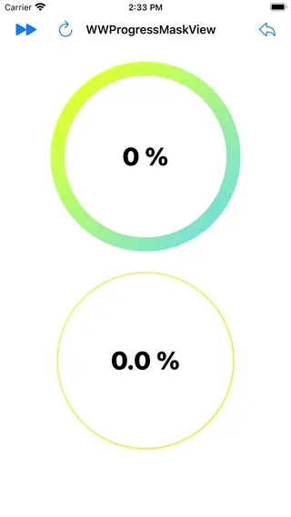
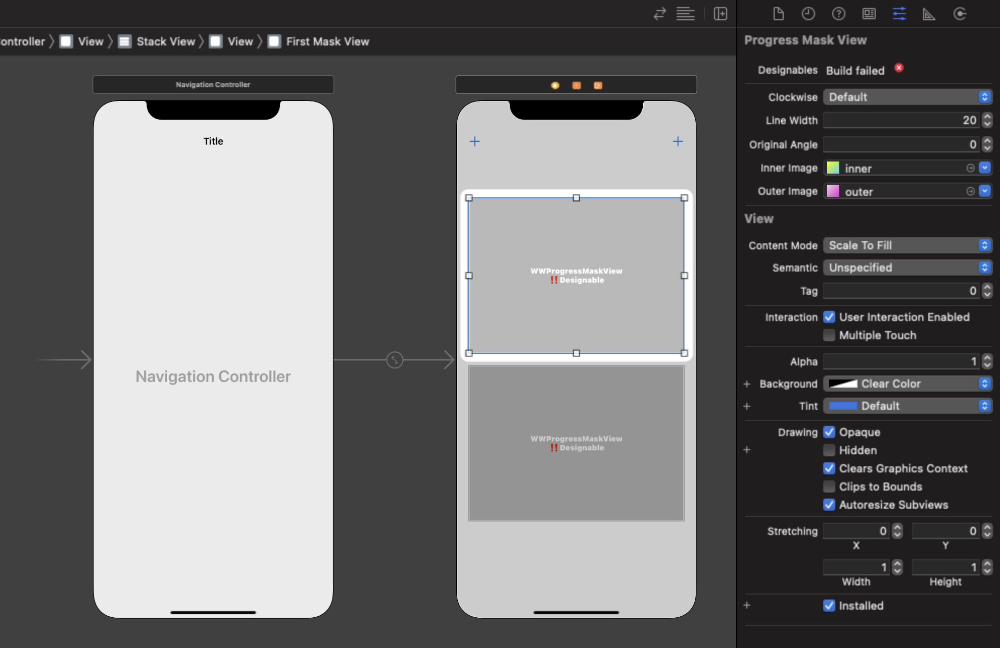

# WWProgressMaskView

[](https://developer.apple.com/swift/) [](https://developer.apple.com/swift/)  [](https://developer.apple.com/swift/) [](https://developer.apple.com/swift/)

### [Introduction - 簡介](https://swiftpackageindex.com/William-Weng)
- The progress ring function of the custom background image uses the principle of picture shielding to make the color of the progress ring more diverse...
- 自訂背景圖的進度環功能，利用圖片遮罩的原理，讓進度環的色彩更多樣化…



### [Installation with Swift Package Manager](https://medium.com/彼得潘的-swift-ios-app-開發問題解答集/使用-spm-安裝第三方套件-xcode-11-新功能-2c4ffcf85b4b)
```bash
dependencies: [
    .package(url: "https://github.com/William-Weng/WWProgressMaskView.git", .upToNextMajor(from: "1.2.2"))
]
```



### Function - 可用函式
|函式|功能|
|-|-|
|setting(originalAngle:lineWidth:clockwise:lineCap:lineGap:innerImage:outerImage:)|設定一些初始值 => 會重畫|
|progressCircle(from:to:)|畫進度條 (以角度為準)|
|progressCircle(progressUnit:)|畫進度條|

### Example
```swift
import UIKit
import WWPrint
import WWProgressMaskView

final class ViewController: UIViewController {

    @IBOutlet weak var firstMaskView: WWProgressMaskView!
    @IBOutlet weak var secondMaskView: WWProgressMaskView!
    @IBOutlet weak var firstLabel: UILabel!
    @IBOutlet weak var secondLabel: UILabel!
    
    private var firstPercent = 0        // 百分比的值 (1 / 100)
    private var secondBasisPoint = 0    // 萬分比的值 (1 / 10000)
    
    override func viewDidLoad() {
        super.viewDidLoad()
        initSetting()
    }
    
    @IBAction func firstTestAction(_ sender: UIBarButtonItem) {
        firstPercent += 10
        firstLabel.text = "\(firstPercent) %"
        firstMaskView.progressCircle(progressUnit: .percent(firstPercent))
    }
    
    @IBAction func secondTestAction(_ sender: UIBarButtonItem) {
        secondBasisPoint += 1250
        secondLabel.text = "\(CGFloat(secondBasisPoint) / 100.0) %"
        secondMaskView.progressCircle(progressUnit: .basisPoint(secondBasisPoint))
    }
    
    @IBAction func resetAction(_ sender: UIBarButtonItem) {
        resetSetting()
    }
}

private extension ViewController {
    
    func initSetting() {
        self.title = "WWProgressMaskView"
        secondMaskView.setting(originalAngle: 90, lineWidth: 20, clockwise: false, lineCap: .round, lineGap: -18, innerImage: nil, outerImage: nil)
    }
        
    func resetSetting() {
        
        firstPercent = 0
        secondBasisPoint = 0
        
        secondLabel.text = "\(CGFloat(secondBasisPoint) / 100.0) %"
        firstLabel.text = "\(firstPercent) %"

        firstMaskView.progressCircle(progressUnit: .percent(firstPercent))
        secondMaskView.progressCircle(progressUnit: .basisPoint(secondBasisPoint))
    }
}
```
